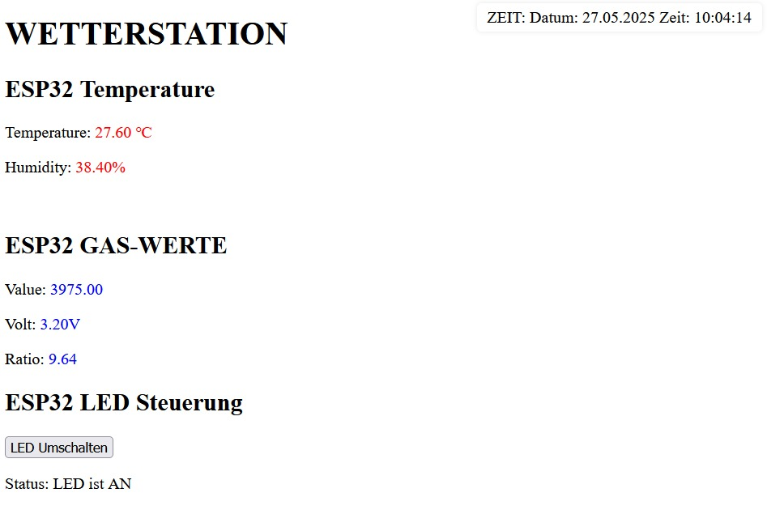
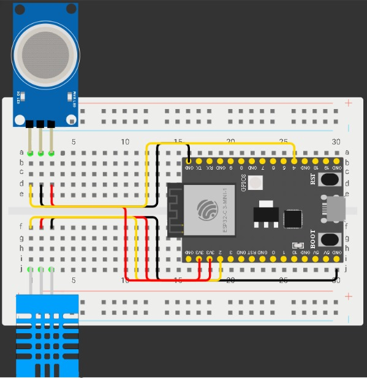
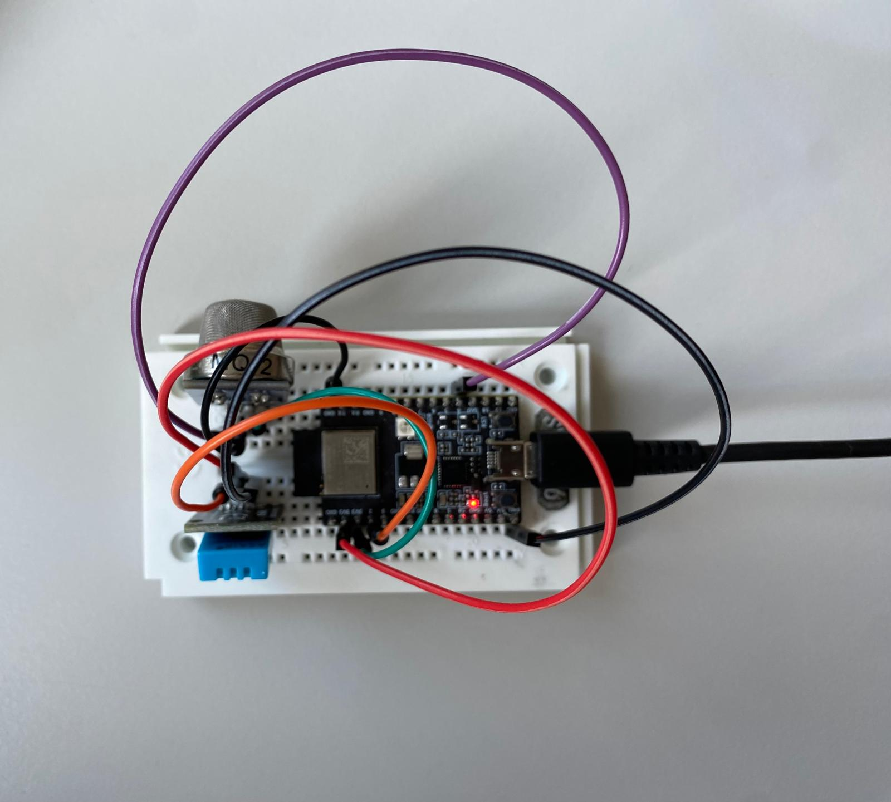

# ESP32 Wetterstation – SYT/ITP Projekt

## Gruppenmitglieder

- Sebastian Kraigher
- Florian Kovacevic

---

## Projektbeschreibung

Wir haben eine Wetterstation mit dem **ESP32** gebaut.  
Sie misst **Temperatur**, **Luftfeuchtigkeit** (DHT11) und **Gaskonzentration** (MQ-2). Die Daten werden über WLAN auf einer Webseite angezeigt.

Zusätzlich haben wir die **eingebaute RGB-LED** des ESP32 als Statusanzeige verwendet, beispielsweise für die WLAN-Verbindung, den Status laufender Messungen oder Temperaturwarnungen. Die LED kann über die Webseite ein- und ausgeschaltet werden.

---

## Funktionen im Überblick

Temperatur und Luftfeuchtigkeit messen  
Gassensor-Werte anzeigen (Rohwert, Spannung, Verhältnis)  
Status-LED für WLAN, Temperatur, Messung  
Eigene Webseite mit Live-Werten  
LED per Webseite steuerbar  
Wi-Fi Verbindung mit Anzeige auf serieller Konsole
Datan an eine Datenbank mithilfe HTTP -Requests senden

---

## Webinterface

Die Webseite zeigt in Echtzeit:
- Temperatur (°C)
- Luftfeuchtigkeit (%)
- Gaswert (analog)
- Spannung des Sensors
- Rs/R0 Verhältnis (Gas)
- LED-Steuerung (an/aus)

---

## Status-LED Bedeutung

| Farbe     | Bedeutung                  |
|-----------|----------------------------|
| Rot     | Kein WLAN                  |
| Blau    | Messung läuft              |
| Orange  | Temperatur über 30 °C      |
| Aus     | LED deaktiviert (Websteuerung) |

---

## Aufbau & Schaltplan

Schaltplan in **Wokwi**:  
  

Foto vom echten Aufbau:  

---

## Verwendete Komponenten

| Bauteil         | Menge |
|-----------------|-------|
| ESP32-C3        | 1     |
| DHT11 Sensor    | 1     |
| MQ-2 Gassensor  | 1     |
| RGB LED (intern)| 1     |
| Breadboard      | 1     |
| Jumperkabel     | 6     |

---

## Projektdateien

- `wetterstation.ino` – Hauptcode für ESP32
- `index.h` – HTML-Seite für Webinterface
- `README.md` – Dokumentation
- `/images` – Fotos, Screenshots, Schaltpläne
- `/Mariadb` – Datenbank für Messwerte

---

## Besonderheiten im Code

- Die HTML-Seite wird direkt im Code als `index.h` eingebunden.
- Sensorwerte werden gefiltert und regelmäßig aktualisiert.
- Die RGB-LED zeigt automatisch den Zustand.
- Die LED kann per HTTP GET über `/led?state=on` oder `off` geschaltet werden.
- NTP-Zeitfunktion gibt die aktuelle Uhrzeit aus.
- Mariadb speichert alle Werte inclusive der Zeit. (Datenbank ist nicht im Code enthalten, da sie separat erstellt werd)

---

## Startanleitung

1. ESP32 mit `wetterstation.ino` flashen
2. WLAN-Zugangsdaten  anpassen
3. Im seriellen Monitor IP-Adresse ablesen
4. IP im Browser öffnen → Webinterface erscheint

---

## Was funktioniert gut?

- Webseite zeigt Werte korrekt
- Status-LED reagiert wie geplant
- LED-Steuerung über Web
- WLAN-Verbindung wird angezeigt
- Datenbank speichert korrekt

---

## DatenBank:

- Die Datenbank speichert die Sensorwerte und ergänzt diese automatisch mit einem Zeitstempel.

- Der ESP sendet seine Messdaten über einen HTTP-Client an die Datenbank.

- Die Datenbank wurde mithilfe von PHP realisiert und empfängt die Daten über ein PHP-Skript.

- Die Datenbank wird mittels einer MySQL-Verbindung erstellt und die Daten werden in einer Tabelle gespeichert.

- Die Datenbank wird mithilfe DOCKER gestartet.

## Projektbilder

**Bild vom Aufbau**

**Screenshot der Webseite** 

**Schaltplan**

---

## Quellen: 

1. [ESP32 - MySQL](https://esp32io.com/tutorials/esp32-mysql), ESP32 Tutorial. Zugegriffen: 18. Februar 2025.

2. R. Santos, [ESP32 HTTP GET and HTTP POST with Arduino IDE | Random Nerd Tutorials](https://randomnerdtutorials.com/esp32-http-get-post-arduino/). 

3. T. Digital, [Interfacing WS2812B Neopixel LED Strip with ESP32](https://theorycircuit.com/esp32-projects/interfacing-ws2812b-neopixel-led-strip-with-esp32/), theoryCIRCUIT. 

4. S. Santos, [ESP32: Create a Wi-Fi Manager (AsyncWebServer library) | Random Nerd Tutorials](https://randomnerdtutorials.com/esp32-wi-fi-manager-asyncwebserver/). 

5. S. Santos, [Getting Date and Time with ESP32 (NTP Client) | Random Nerd Tutorials](https://randomnerdtutorials.com/esp32-ntp-client-date-time-arduino-ide/). 

6. [ESP - WiFi und Webserver starten - Programmieren mit Arduino](https://hartmut-waller.info/arduinoblog/esp-wifi-und-webserver-starten/). Zugegriffen: 18. Februar 2025.

7. R. Santos, [ESP32 Web Server - Arduino IDE | Random Nerd Tutorials](https://randomnerdtutorials.com/esp32-web-server-arduino-ide/). Zugegriffen: 18. Februar 2025.

8. [Allnet 4duino_40in1_Kit1 Sensorkit 1 Set Passend für (Entwicklungskits): Arduino kaufen](https://www.conrad.de/de/p/allnet-4duino-40in1-kit1-sensorkit-1-set-passend-fuer-entwicklungskits-arduino-2233140.html). Zugegriffen: 18. Februar 2025.

9. S. Santos, [ESP32 with DHT11/DHT22 Temperature and Humidity Sensor using Arduino IDE | Random Nerd Tutorials](https://randomnerdtutorials.com/y<esp32-dht11-dht22-temperature-humidity-sensor-arduino-ide/). Zugegriffen: 18. Februar 2025.

10. [Arduino - DHT11 | Arduino Tutorial](https://arduinogetstarted.com/tutorials/arduino-dht11), Arduino Getting Started. Zugegriffen: 18. Februar 2025.
